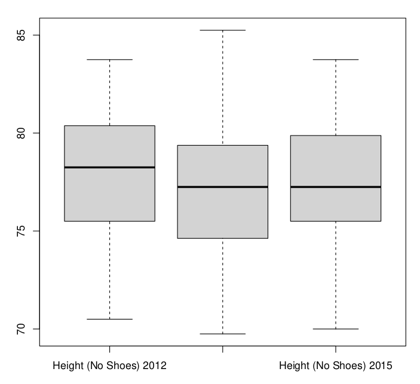
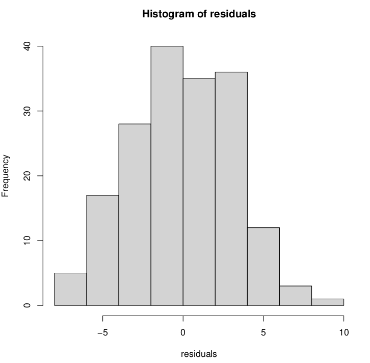
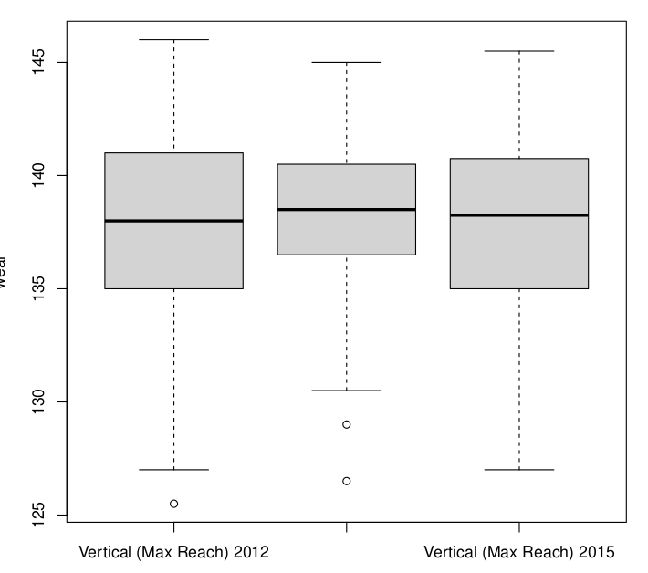
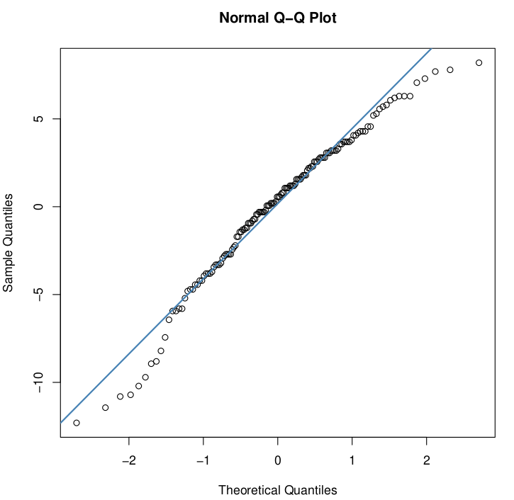
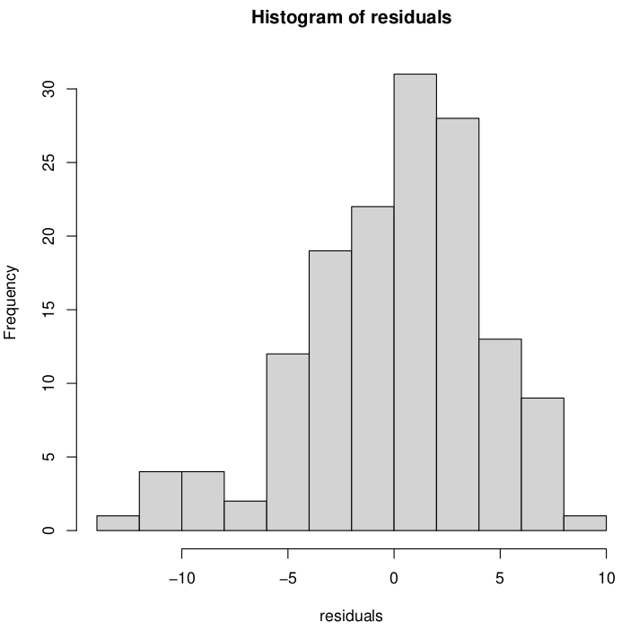

Partiendo de los datos del draft de los jugadores de la NBA del año 2014, se desea hacer un análisis de varianza sobre los datos de estudio. Para ello, el planteamiento fue el siguiente:

Dado que en un inicio solamente se tenían datos para un año específico, teníamos dos opciones, o considerar la varianza de los datos para cada jugador(pero para cada jugador solamente teniamos un único dato, de manera que esto carecía de sentido), o buscar más datos de años anteriores y/o posteriores, y analizar las varianzas de ciertas características(altura, peso, agilidad, etc) por años.

#### Height (No Shoes)

De modo que, se desea saber si existen diferencias entre las alturas de los jugadores de la nba de los años 2012, **2014** y 2015

$H_0: \mu_{2012}=\mu_{2014}=\mu_{2015}$

$H_a:\mu_i\ne\mu_j,~~i\ne j$

Apoyándonos de la representación gráfica de las medias de las alturas, tenemos:

A simple vista, parecen ser considerablemente parecidos los datos, de modo que, según cual sea la tolerancia con la cual trabajemos, se rechazará o no nuestra hipótesis nula. Al realizar el **análisis de varianza**, tenemos que el p-value 0.28 > 0.05, aceptando entonces $H_0$, la altura de los jugadores de la nba en los años 2012, 2014 y 2015 son muy similares.

Verificando finalmente los supuestos del modelo realizando las pruebas de hipótesis de Shapiro, Durbin-Watson y Bartlett  respectivamente:

1) los $e_{ij}$ siguen una distribución normal: p-value = 0.43 $\gg$ 0.05, podemos decir entonces que están normalmente distribuidos.

2) los $e_{ij}$ son independientes: p-value = 0.14 > 0.05, por lo que los errores son independientes.

3) los $e_{ij}$ tienen la misma varianza: p-value = 0.92 $\gg$ 0.05, las varianzas de los residuos son homogéneas.

#### Vertical (Max Reach)

A continuación, analizamos el alcance  vertical máximo.

Se desea entonces saber si existen diferencias entre el alcance máximo de los jugadores de la nba en los años 2012, **2014** y 2015

$H_0: \mu_{2012}=\mu_{2014}=\mu_{2015}$

$H_a:\mu_i\ne\mu_j,~~i\ne j$

Al graficar los resultados podemos observar:

De manera parecida al caso anterior, los datos se asemejan bastante. Luego de hacer el **análisis de varianza**, tenemos que el p-value 0.96 $\gg$ 0.05, aceptando entonces $H_0$, el alcance vertical máximo de los jugadores de la nba en los años 2012, 2014 y 2015 es casi idéntico.

Al observar las gráficas anteriores, vemos que la normalidad de los residuos en esta ocasión es bastante discutible, aún así, realizaremos las tres pruebas de hipótesis como ya es costumbre(aunque baste con que una de ellas falle):

1) los $e_{ij}$ **no** siguen una distribución normal: p-value = 0.003 $\ll$ 0.05, podemos decir entonces que están normalmente distribuidos.

2) los $e_{ij}$ son independientes: p-value = 0.49 $\gg$ 0.05, por lo que los errores son independientes.

3) los $e_{ij}$ tienen la misma varianza: p-value = 0.48 $\gg$ 0.05, las varianzas de los residuos son homogéneas.

