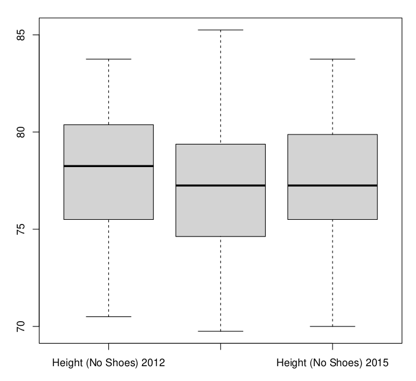
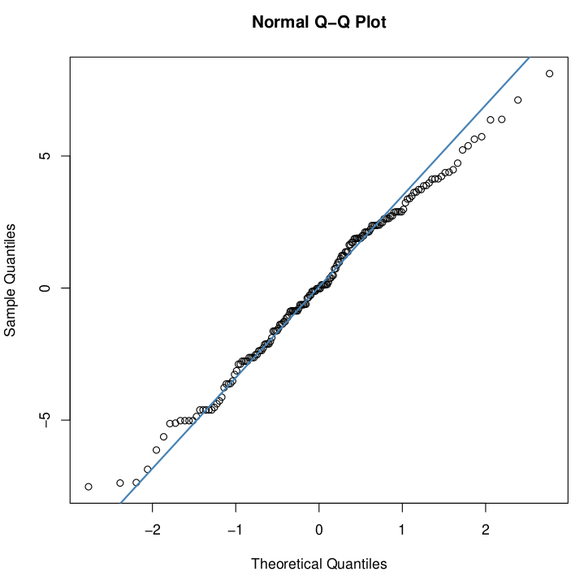
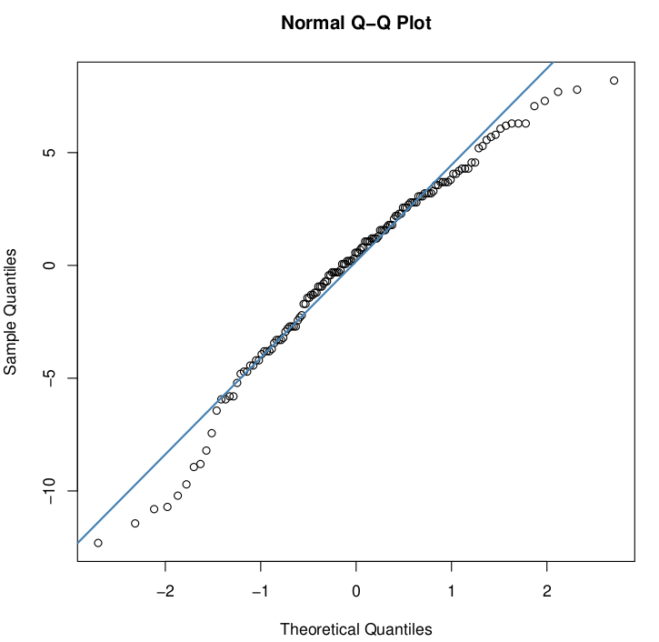
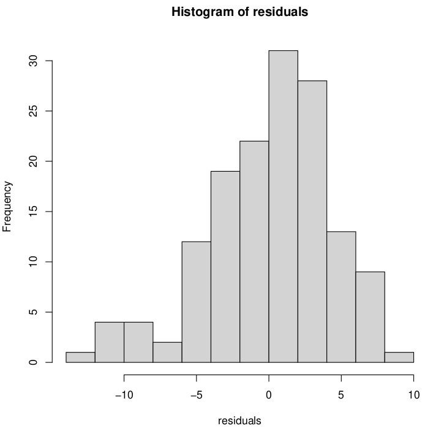
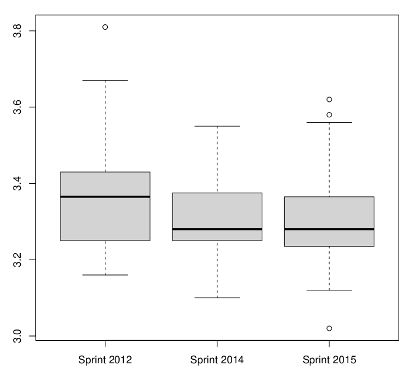

# Proyecto Estadística Descriptiva 

## Fase 2

## Integrantes:

* C-412 Richard Garcı́a De la Osa. richard.garcia@estudiantes.matcom.uh.cu
* C-412 Andy A. Castañeda Guerra. andy.castaneda@estudiantes.matcom.uh.cu
* C-411 Adrián Hernández Pérez. a.hernandez3@estudiantes.matcom.uh.cu

##### 

### Abstract:

Un breve análisis estadístico sobre los jugadores del draft de la NBA del año 2014.

Partiendo de los datos de las mediciones físicas de los jugadores de la NBA, se realizaron varios análisis sobre los mismos, en aras de caracterizar y hallar relaciones entre las mismas. Se consideraron técnicas de reducción de dimensión, análisis de varianza y correlación entre los datos.

### Introducción

La ***National Basketball Association***(NBA) cuenta cada año con discímiles aspirantes a unirse a uno de los equipos y probar su capacidad y talento a nivel profesional. Para ello se realiza anualmente hace más de medio siglo un evento conocido como el **NBA draft pick**, donde dichos equipos escogen a qué jugadores incorporar a sus bancas de todos aquellos posibles candidatos. El análisis que proponemos a continuación está basado en los datos recogidos de dicho *draft pick* en el año 2014. Los datos consisten en las aptitudes físicas cuantificadas para cada uno de los candidatos considerados, por ejemplo su altura, su peso y grasa corporal, altura de salto, envergadura de las extremidades, entre otros. Se realizará un análisis de varianza(ANOVA) entre los datos recogidos en el 2014, 2012 y 2015, para contrastar las variaciones de las capacidades de los atletas. También haremos una clasificación de los jugadores por categorías para reducir la dimensión de los datos.  

Tabla de correlación de las variables.

Se aprecia que existe dependencia lineal entre las variables.

__Modelo encontrado con todas las variables:__

__Modelo:__

​	$Vertical~(Max~Reach) = \beta_0 + \beta_1Standing~reach + \beta_2Vertical~(Max)+e$.

​	Podemos ver que el valor del intercepto es alto, esto indica que gran parte del Vertical (Max Reach) no está muy bien explicada a partir de las variables independientes, lo cual no es muy deseable. Además notamos que los valores de Pr(>|t|) para todas son menores que 0.05.

​	De estos valores podemos ver que el R-squared es 0.8582 que está por encima de 0.70 por lo que indica que el modelo es bueno, sumando esto a que el valor del intercepto es malo podría indicar que necesitamos considerar otros factores. También podemos notar que el p-value es menor que 0.05 lo que indica que nuestro modelo no está mal.

Analizando los Residuos:

La media de los errores es cero y la suma de los errores es cero.

El valor de p-value es 3.045e-08 < 0.05 por lo que no podemos decir que los errores siguen una distribución normal(Falla).

El p-value es 0.8654 > 0.05 por lo que podemos afirmar que los errores son independientes.

Como el p-value es 0.6145 > 0.05 no podemos rechazar la heterocedasticidad. Por lo que el supuesto de Homocedasticidad se mantiene.

Por lo visto, no se cumplen todos los supuestos del modelo.

__Modelo:__	

$Vertical~(Max~Reach) = \beta_0 + \beta_1Height~(No~Shoes) + \beta_2Height..(With~Shoes)+\beta_3Standing~reach+\beta_4Vertical~(Max)$

$+\beta_5Vertical~(No~Step)+e$.

​	Podemos ver que el valor del intercepto no es muy alto, esto indica que parte del Vertical (Max Reach) no está muy bien explicada a partir de las variables independientes, lo cual no es muy deseable. Además notamos que los valores de Pr(>|t|) para algunos son menores que 0.05 y para otros mayores.

​	De estos valores podemos ver que el R-squared es 0.8865 que está por encima de 0.70 por lo que indica que el modelo es bueno, sumando esto a que el valor del intercepto no es muy bueno podría indicar que necesitamos considerar otros factores. También podemos notar que el p-value es menor que 0.05 lo que indica que nuestro modelo no está mal.

Analizando los Residuos:

La media de los errores es cero y la suma de los errores es cero.

El valor de p-value es 0.0002441 < 0.05 por lo que no podemos decir que los errores siguen una distribución normal(Falla).

El p-value es 0.6313 > 0.05 por lo que podemos afirmar que los errores son independientes.

Como el p-value es 0.6088 > 0.05 no podemos rechazar la heterocedasticidad. Por lo que el supuesto de Homocedasticidad se mantiene.

Por lo visto, no se cumplen todos los supuestos del modelo.

__Modelo:__	

$Vertical~(Max~Reach) = \beta_0 + \beta_1Height~(No~Shoes) + \beta_2Height..(With~Shoes)+\beta_3Standing~reach+\beta_4Vertical~(Max)$

$+\beta_5Vertical~(No~Step)+\beta_6Vertical~(No~Step~Reach)+e$.

​	Podemos ver que el valor del intercepto es bastante bajo, esto indica que gran parte del Vertical (Max Reach) está muy bien explicada a partir de las variables independientes, lo cual es muy deseable. Además notamos que los valores de Pr(>|t|) para algunos son menores que 0.05 y para otros mayores.

​	De estos valores podemos ver que el R-squared es 0.9999 que está por encima de 0.70 y es casi 1 lo que indica que el modelo es muy bueno. También podemos notar que el p-value es menor que 0.05 lo que indica que nuestro modelo está bien.

Analizando los Residuos:

La media de los errores es cero y la suma de los errores es cero.

El valor de p-value es 4.178e-12 < 0.05 por lo que no podemos decir que los errores siguen una distribución normal(Falla).

El p-value es 0.8062 > 0.05 por lo que podemos afirmar que los errores son independientes.

Como el p-value es 0.2764 > 0.05 no podemos rechazar la heterocedasticidad. Por lo que el supuesto de Homocedasticidad se mantiene.

Por lo visto, no se cumplen todos los supuestos del modelo.

__Modelo:__	

$Vertical~(Max~Reach)=\beta_0+\beta_1Vertical(No~Step~Reach)+\beta_2Vertical~(Max)+e$.

​	Podemos ver que el valor del intercepto no es muy baj, lo que indica que gran parte del Vertical (Max Reach) puede no estar muy bien explicada a partir de las variables independientes, lo cual no es muy deseable. Además notamos que los valores de Pr(>|t|) para uno es menor que 0.05 y para el otro es mayor.

​	De estos valores podemos ver que el R-squared es 0.8914 que está por encima de 0.70 lo que indica que el modelo es bueno. También podemos notar que el p-value es menor que 0.05 lo que indica que nuestro modelo está bien.

Analizando los Residuos:

La media de los errores es cero y la suma de los errores es cero.

El valor de p-value es 0.5286 > 0.05 por lo que podemos decir que los errores siguen una distribución normal.

El p-value es 0.6693 > 0.05 por lo que podemos afirmar que los errores son independientes.

Como el p-value es 0.1706 > 0.05 no podemos rechazar la heterocedasticidad. Por lo que el supuesto de Homocedasticidad se mantiene.

Por lo visto, se cumplen todos los supuestos del modelo.

Modelos analizados:

$-Vertical~(Max~Reach) = \beta_0 + \beta_1Standing~reach + \beta_2Vertical~(Max)+e$. No cumple los supuestos, Adjusted R-squared:  0.8582.

$-Vertical~(Max~Reach) = \beta_0 + \beta_1Height~(No~Shoes) + \beta_2Height~(With~Shoes)+\beta_3Standing~reach+\beta_4Vertical~(Max)$

$+\beta_5Vertical~(No~Step)+e$. No cumple los supuestos, Adjusted R-squared:  0.8865.

$-Vertical~(Max~Reach) = \beta_0 + \beta_1Height~(No~Shoes) + \beta_2Height..(With~Shoes)+\beta_3Standing~reach+\beta_4Vertical~(Max)$

$+\beta_5Vertical~(No~Step)+\beta_6Vertical~(No~Step~Reach)+e$. No se cumplen los supuestos, $~~~~~~~~~~~~~~~~~~~~~~~~~~~~~~~~~~~~~~~~~$Adjusted R-squared:  0.9999.

$-Vertical~(Max~Reach)=\beta_0+\beta_1Vertical(No~Step~Reach)+\beta_2Vertical~(Max)+e$. Se cumplen los supuestos, Adjusted R-squared:  0.8914.

El modelo con mejor R-squared ajustado es el de:

$Vertical~(Max~Reach)=\beta_0+\beta_1Vertical(No~Step~Reach)+\beta_2Vertical~(Max)+e$.

Quedaría $Vertical~Max~Reach)=10.88442+0.86494*Vertical(No~Step~Reach)+0.35319*Vertical~(Max)$.

### Reducción de dimensión

La técnica de reducción de dimesión empleada para clasificar los datos de los jugadores de la NBA en el año 2014 fue la **ténica jerárquica** de **clústers**.

Se consideraron todas aquellas mediciones cuantitativas que los jugadores tenían, además se omitió el análisis de las columnas vacías o parcialmente incompletas. Posteriormente, se ejecutó el algoritmo k-means con distintos valores para la cantidad de clústers creados, comenzando en 2, y analizando hasta para 5 clústers.

De todos los resultados obtenidos, elegimos el más razonable, tanto por el porcentaje de similitud de los jugadores que pertenecían a las mismas categorías, como para claridad en cuanto a la interpretación que se le puede dar a los posibles *outliers* que detectamos. A continuación, la tabla:

| Cat   | Height (NoShoes) | Height (WithShoes) | Wingspan | Standing Reach | Vertical (Max) | Vertical (MaxReach) | Vertical (NoStep) |
| ----- | ---------------- | ------------------ | -------- | -------------- | -------------- | ------------------- | ----------------- |
| **1** | 80.4             | 81.72              | 86.16    | 106.27         | 34.50          | 140.77              | 29.72             |
| **2** | 74.3             | 75.78              | 79.57    | 99             | 36.47          | 135.47              | 30.60             |
| **3** | 78.4             | 79.80              | 82.88    | 103.73         | 35.21          | 138.95              | 29.59             |

| Cat   | Vertical (NoStepReach) | Weight | Body Fat | Hand Length | Hand Width | Agility | Sprint |
| ----- | ------------------------ | ------ | -------- | ----------- | ---------- | ------- | ------ |
| **1** | 136.00                   | 251.22 | 9.70     | 9.19        | 9.86       | 11.58   | 3.37   |
| **2** | 129.60                   | 188.63 | 5.71     | 8.42        | 8.93       | 11.33   | 3.26   |
| **3** | 133.33                   | 218.52 | 7.21     | 8.82        | 9.11       | 11.34  | 3.31   |

**Con un porcentaje de similitud del 79.0%**

Acá se observa la clara división entre los jugadores en tres categorías. La categoría **No.1**, se trata de los jugadores más corpulentos en genral, aquellos de mayor altura, mayor envergadura de los brazos, superior alcance estando de pie, mayor peso, manos más extensas, y mayor grasa corporal. La contraparte de estos, serían los jugadores pertenecientes a la categoría **No.2**, comprendiendo aquellos más pequeños(aun así son considerablemente más altos que cualquier persona promedio), de menor extensión entre brazo y brazo, menos pesados y de menor grasa corporal, además con las manos notablemente más pequeñas, y a la vez menor alcance vertical estando de pie. Finalmente en la categoría **No.3** restante, quedarían aquellos jugadores "promedio", cuyas mediciones son intermedias, su altura no es suficiente como para estar considerados entre los más altos, pero tampoco es tan pequeña como para caer en la categoría **No.2**, igualmente con su peso, su alcance vertical sin saltar, la evergadura de sus brazos, etc.

De estos datos, cabe resaltar algunas observaciones suficientemente llamativas:

* En primer lugar, los jugadores de menor estatura son aquellos que mayor alcance vertical(Vertical Max) poseen al saltar sin contar la altura extra que le confieren sus brazos, es decir, que al saltar, son los que más elevan sus pies del suelo. Aún así, esto no es suficiente como para ser los de mayor alcance vertical al saltar si se mide la altura a la que se extienden sus brazos(Vertical Max Reach), siendo nuevamente los más modestos en este campo. Esto puede resultar intuitivo si tenemos en cuenta que estos jugadores son aquellos de menor masa y grasa corporal.
* En segundo lugar, las medidas de agilidad y velocidad de los jugadores más corpulentos y de mayor peso y grasa corporal son ligeramente superiores a las de los demás jugadores. Uno esperaría que dado que son más pesados, quizás sean también más "torpes" o lentos, sin embargo, estas medidas en los datos estudiados se mantienen bastante similares para todos los jugadores estudiados, y curiosamente, los jugadores más altos son los más ágiles y veloces, mientras que los más chicos son los menos ágiles y más lentos.

### ANOVA

Partiendo de los datos del draft de los jugadores de la NBA del año 2014, se desea hacer un análisis de varianza sobre los datos de estudio. Para ello, el planteamiento fue el siguiente:

Dado que en un inicio solamente se tenían datos para un año específico, teníamos dos opciones, o considerar la varianza de los datos para cada jugador(pero para cada jugador solamente teniamos un único dato, de manera que esto carecía de sentido), o buscar más datos de años anteriores y/o posteriores, y analizar las varianzas de ciertas características(altura, peso, agilidad, etc) por años.

#### Height (No Shoes)

De modo que, se desea saber si existen diferencias entre las alturas de los jugadores de la nba de los años 2012, **2014** y 2015

$H_0: \mu_{2012}=\mu_{2014}=\mu_{2015}$

$H_a:\mu_i\ne\mu_j,~~i\ne j$

Apoyándonos de la representación gráfica de las medias de las alturas, tenemos:

A simple vista, parecen ser considerablemente parecidos los datos, de modo que, según cual sea la tolerancia con la cual trabajemos, se rechazará o no nuestra hipótesis nula. Al realizar el **análisis de varianza**, tenemos que el p-value 0.28 > 0.05, aceptando entonces $H_0$, la altura de los jugadores de la nba en los años 2012, 2014 y 2015 son muy similares.

Verificando finalmente los supuestos del modelo realizando las pruebas de hipótesis de Shapiro, Durbin-Watson y Bartlett  respectivamente:

1) los $e_{ij}$ siguen una distribución normal: p-value = 0.43 $\gg$ 0.05, podemos decir entonces que están normalmente distribuidos.

2) los $e_{ij}$ son independientes: p-value = 0.14 > 0.05, por lo que los errores son independientes.

3) los $e_{ij}$ tienen la misma varianza: p-value = 0.92 $\gg$ 0.05, las varianzas de los residuos son homogéneas.

#### Vertical (Max Reach)

A continuación, analizamos el alcance  vertical máximo.

Se desea entonces saber si existen diferencias entre el alcance máximo de los jugadores de la nba en los años 2012, **2014** y 2015

$H_0: \mu_{2012}=\mu_{2014}=\mu_{2015}$

$H_a:\mu_i\ne\mu_j,~~i\ne j$

Al graficar los resultados podemos observar:

De manera parecida al caso anterior, los datos se asemejan bastante. Luego de hacer el **análisis de varianza**, tenemos que el p-value 0.96 $\gg$ 0.05, aceptando entonces $H_0$, el alcance vertical máximo de los jugadores de la nba en los años 2012, 2014 y 2015 es casi idéntico.

Al observar las gráficas anteriores, vemos que la normalidad de los residuos en esta ocasión es bastante discutible, aún así, realizaremos las tres pruebas de hipótesis como ya es costumbre(aunque baste con que una de ellas falle):

1) los $e_{ij}$ **no** siguen una distribución normal: p-value = 0.003 $\ll$ 0.05, luego los residuos no están normalmente distribuidos.

2) los $e_{ij}$ son independientes: p-value = 0.49 $\gg$ 0.05, los errores son independientes.

3) los $e_{ij}$ tienen la misma varianza: p-value = 0.48 $\gg$ 0.05, las varianzas de los residuos son homogéneas.

#### Weight

Analizemos en esta ocasión el peso de los jugadores.

Nuestra misión ahora será saber si existen diferencias entre el peso de los jugadores de la nba en los años 2012, **2014** y 2015

$H_0: \mu_{2012}=\mu_{2014}=\mu_{2015}$

$H_a:\mu_i\ne\mu_j,~~i\ne j$

Como es costumbre, veamos la gráfica de los datos

En esta ocasión, vemos una diferencia ligera, pero notable, de los datos del 2012 respecto a los demás años. Luego de hacer el **análisis de varianza**, tenemos que el p-value 0.02 < 0.05, rechazando $H_0$, luego el peso de los jugadores de la **NBA** en los años estudiados ha cambiado.

Viendo las gráficas, nuevamente la normalidad de los residuos es dudosa. Realizando las pruebas de hipótesis de Shapiro, Durbin-Watson y Bartlett  respectivamente tenemos:

1) los $e_{ij}$ siguen una distribución normal: p-value = 0.054 > 0.050, podemos decir entonces que están normalmente distribuidos para la tolerancia del 5%.

2) los $e_{ij}$ son independientes: p-value = 0.19 > 0.05, por lo que los errores son independientes.

3) los $e_{ij}$ tienen la misma varianza: p-value = 0.97 $\gg$ 0.05, las varianzas de los residuos son homogéneas.

#### Sprint

Por último, hagamos un último análisis de varianza, en este caso para la velocidad de los jugadores.

Deseamos saber si la velocidad de los jugadores de la nba ha cambiado en los años 2012, **2014** y 2015

$H_0: \mu_{2012}=\mu_{2014}=\mu_{2015}$

$H_a:\mu_i\ne\mu_j,~~i\ne j$

Viendo la gráfica de los datos, tenemos

Nuevamente, vemos una leve diferencia de los datos del 2012 respecto al resto. Haciendo entonces el **análisis de varianza**, tenemos que el p-value 0.03 < 0.05, rechazando $H_0$, luego las velocidades de los jugadores de la **NBA** difieren en los años estudiados.

En este último análisis, nos volvemos a enfrentar con la dubitativa de la normalidad de los residuos, si bien en esta ocasión la gráfica habla por si sola. Aún así, haremos las pruebas de hipótesis de Shapiro, Durbin-Watson y Bartlett  respectivamente tenemos:

1) los $e_{ij}$ **no** siguen una distribución normal: p-value = 0.0001 $\ll$ 0.05, luego los residuos no están normalmente distribuidos

2) los $e_{ij}$ son independientes: p-value = 0.39 $\gg$ 0.05, por lo que los errores son independientes.

3) los $e_{ij}$ tienen la misma varianza: p-value = 0.28 $\gg$ 0.05, las varianzas de los residuos son homogéneas.

### Conclusión

Luego de este extenso análisis de los datos con los que contábamos, en el cual profundizamos los conocimientos adquiridos a lo largo del curso para el tratamiento de los datos, logramos obtener **información**, encontrar conexiones invisibles entre lo que a simple vista son números, y en general lograr un mejor entendimiento del objeto de estudio. Se analizó la correlación(directa, inversa o inexistente) entre distintas medidas físicas de jugadores de la NBA en el año 2014. Igualmente, se aplicaron técnicas de clasificación para reducción de dimensión, clasificando a los jugadores en categorías similares según los datos, y se culminó realizando un análisis a mayor escala, considerando datos de años anteriores y posteriores con tal de contrastar y realizar un análisis de varianza(ANOVA) efectivo sobre distintas categorías como la agilidad, el peso, la altura y la altura de salto de los deportitas.